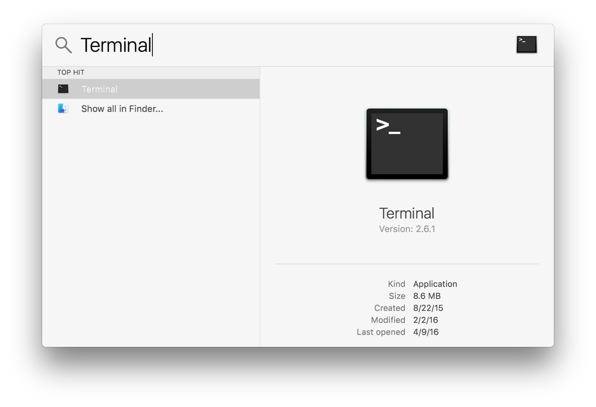
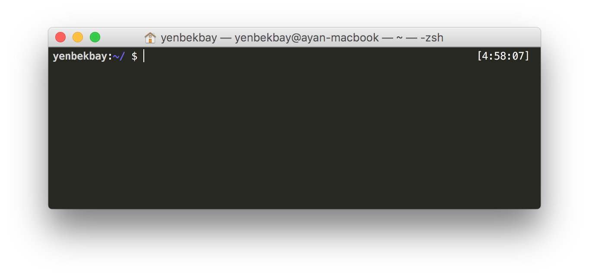

# Setup instructions

The following instructions will help you to get ready for N17R programming classes. If you are an experienced programmer you may choose to skip some of the steps, but make sure to check the bootstrap script.

## GitHub account

Have you signed up to GitHub? If not, [do it right away](https://github.com/join).

## Configuring the command line

Open the Terminal (click on the magnifying glass icon in the top right corner of your screen and type `Terminal`):



Copy-paste the following command, i.e. what is after the dollar sign `$`. The dollar sign is a common convention to indicate this is something you need to type in the terminal.

```bash
$ curl https://raw.githubusercontent.com/N17R/setup/master/bootstrap.sh | bash
```

Please follow the instructions, and if you have any questions just call a mentor.

This script will configure your laptop and install all the necessary packages for your command line. If you need some clarifications about exactly that means, you can open the link in the command and read the comments.

## Dotfiles

Hackers love to refine and polish their shell and tools. We'll start with a great default configuration provided by N17R, stored on GitHub. If you are more advanced, you can [fork the repository](https://github.com/N17R/dotfiles/fork) and make your adjustments before proceeding.

Type this in your terminal:

```bash
$ git clone --recursive https://github.com/N17R/dotfiles.git ~/dotfiles && set -- -f; bash ~/dotfiles/sync.sh
```

You may want to change the username in the Github link above if you forked the repository to use your own configuration.

When the script is finished, quit your terminal and restart it (⌘ + Q).

You should now see something like this:



If not, stop **right away** and call a mentor.
